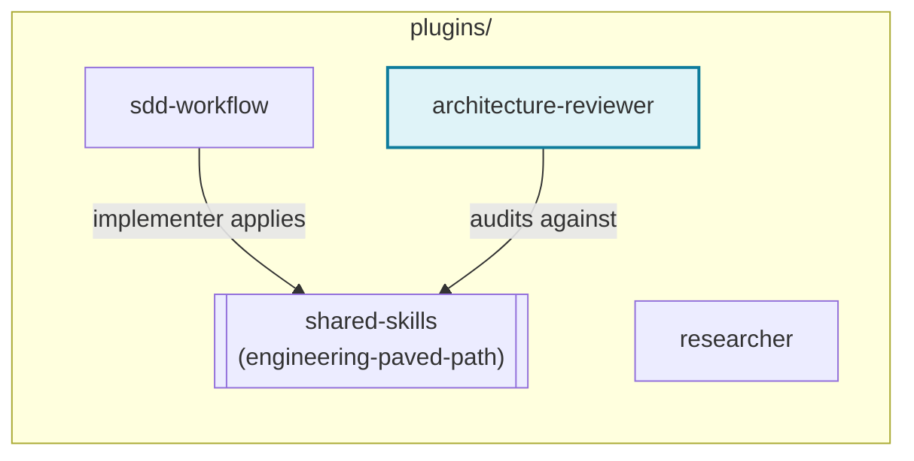

# architecture-reviewer

A read-only agent that audits a diff or file set against a repo's
structural contracts and reports violations with `file:line` evidence — it
never edits code.

## What it checks

The [`architecture-reviewer`](agents/architecture-reviewer.md) agent
grounds every finding in the `engineering-paved-path` skill (from the
`shared-skills` plugin — declared as this plugin's dependency, see
`plugin.json`): inward-only layer dependencies, thin boundary
handlers/routes, one dependency-injection composition root, a single
secrets chokepoint, an I/O-free core (if the repo has one), and no
duplicated shared contracts. If the repo also documents its own
architecture conventions (an `AGENTS.md`, `CLAUDE.md`, or similar), those
are read too and take precedence where they add or override a rule.

Explicitly out of scope: style nits, naming conventions, runtime
correctness bugs, test quality, performance, and security review — those
belong to a separate review process.

## Using it standalone

This agent doesn't require `sdd-workflow` to be installed. Hand it a diff
or an explicit file list and ask it to review — it reports a severity
table (`critical`/`high`/`medium`/`low`/`info`) and a `PASS`/`FAIL` gate
(zero `critical` and zero `high` required to pass).

## Using it inside the SDD pipeline

If `sdd-workflow` is also installed, its `run-plan` skill invokes this
agent as an optional Phase 3b after `plan-verifier`'s spec-compliance
check, and feeds a `critical`/`high` finding into the same fix-loop that a
failing verdict triggers. See `sdd-workflow`'s own README for the full
chain.

## Dependency: `shared-skills`

Install `shared-skills` alongside this plugin — without it, the
`engineering-paved-path` skill this agent's checks are grounded in won't
resolve.

`researcher` (unconnected above) has no dependency on `shared-skills` — it
never invokes a skill.
