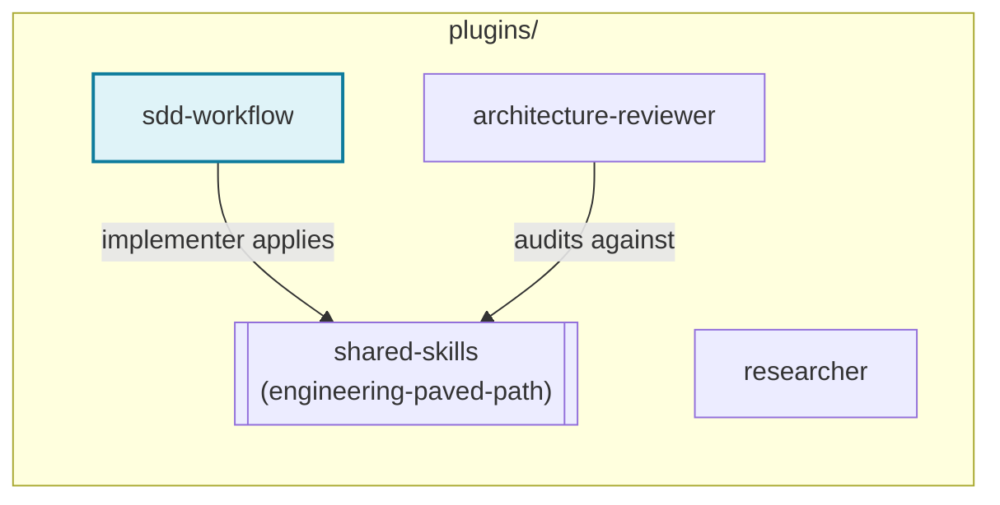

# sdd-workflow

Spec-Driven Development as six coordinated agents, an orchestrator skill,
and a manual retrospective skill. Turns a feature request into a Spec, a
Development Plan, shipped code, tests, a spec-compliance verdict, and
documentation — each stage handing the next a file, not a conversation.

## Why file-based handoff

Each agent reads only the file the previous stage produced — never the
full conversation that produced it. This keeps token cost and wall-clock
time bounded on a multi-agent pipeline: passing full conversation history
forward between agents ("telephone") is one of the biggest cost drivers in
agentic pipelines, and this plugin is designed to avoid it by construction.

Every task gets its own folder, `.sdd/<task-slug>/`, holding whichever of
these exist for that task:

```
.sdd/<task-slug>/
├── spec.md                 # spec-creator's output
├── plan.md                 # implementation-planner's output
├── verification-report.md  # plan-verifier's output
└── retro.md                # the `run` skill's output (manual, optional)
```

Pick `<task-slug>` once, at the start of a task, and reuse it through every
stage — it's the only thing tying the pipeline together.

## The agents

| Agent | Role | Model | Reads | Produces |
|---|---|---|---|---|
| [spec-creator](agents/spec-creator.md) | Turns a request into a **Spec** — a decision record (problem, goals, EARS acceptance criteria, edge cases, NFRs), not a plan. The one agent allowed to write `.sdd/<task-slug>/spec.md`. | Opus | Request; design assets; existing specs; real code | `spec.md` |
| [implementation-planner](agents/implementation-planner.md) | Turns a scoped request (+ Spec, if one exists) into a **Development Plan** — work items, each naming its files and applicable skills. Confirms multi-agent vs. single-agent execution mode. | Opus | `spec.md` (if any); real code; installed skills catalog | `plan.md` |
| [implementer](agents/implementer.md) | Executes the plan: applies each work item's named skills, edits/writes code, runs existing tests, self-checks the diff. No architecture/security review, no new test authorship. | Sonnet | `plan.md` | Code changes; Implementation Report |
| [test-writer](agents/test-writer.md) | Writes tests for what `implementer` shipped, as an independent pass — oracle derived from the plan/spec *before* reading the implementation, so tests assert intended behavior, not just current behavior. | Sonnet | `plan.md`, `spec.md`, the diff (wiring facts only) | Test files; Test Report |
| [plan-verifier](agents/plan-verifier.md) | Spec-compliance gate: per-item traceability of the implementation against the plan's own requirements, ending in a non-hedgeable `VERDICT: PASS / FAIL / PASS WITH REQUIRED FIXES`. Applies no skill — this is a compliance check, not a code-quality judgment. | Opus | `plan.md`, the diff, the Test Report (for what to check only) | `verification-report.md` |
| [doc-writer](agents/doc-writer.md) | Documents what actually shipped and passed — the last stop, so nothing gets documented before it's verified. | Sonnet | The diff, `plan.md`, review findings | New docs |

## Why architecture review isn't in this list

Architecture review is a separate plugin — [`architecture-reviewer`](../architecture-reviewer/) —
not a phase of `plan-verifier`. Keeping it separate means it stays
invocable on its own, against any diff, not only inside this pipeline
(auditing a PR that never went through `spec-creator` at all, for
instance). `sdd-workflow`'s own `run-plan` orchestrator invokes it as an
optional phase when it's installed (see below) — it just isn't baked into
`plan-verifier` itself.

## The skills

- **[run-plan](skills/run-plan/SKILL.md)** — orchestrates the back half of
  the chain (`implementer` → `test-writer` → `plan-verifier` →
  `architecture-reviewer`, if installed → `doc-writer` → a live smoke
  check), pausing for approval after every phase, with a capped fix-loop
  back to `implementer` on a failing verdict or a critical/high finding.
  Invoke with `/run-plan <task-slug>` once a plan exists and is approved.
  Never runs `spec-creator` or `implementation-planner` — those stay
  manual, before this skill starts.
- **[run](skills/run/SKILL.md)** — a workflow retrospective: token/time
  cost per agent, round-trips, self-reported friction, and concrete
  recommendations for next time, covering whatever multi-agent session
  just happened in this conversation. **Manual only** — invoke with `/run`
  or by asking for a retro by name; never runs automatically at the end of
  `run-plan`.
- **[backend-service-patterns](skills/backend-service-patterns/SKILL.md)**,
  **[frontend-component-patterns](skills/frontend-component-patterns/SKILL.md)**,
  **[typed-contracts](skills/typed-contracts/SKILL.md)**,
  **[security-baseline](skills/security-baseline/SKILL.md)**,
  **[diagramming](skills/diagramming/SKILL.md)**,
  **[session-insights-log](skills/session-insights-log/SKILL.md)** —
  stack-agnostic domain skills `implementer`/`test-writer` apply per work
  item, and `spec-creator`/`doc-writer` apply where noted in their own
  files. If the target repo has its own more specific skill for its actual
  framework, that one wins for framework-specific detail; these are the
  transferable-principles fallback.

## Dependency: `shared-skills`

This plugin declares a dependency on the `shared-skills` plugin (see
`plugin.json`) for the `engineering-paved-path` skill, which `implementer`
applies proactively while writing layered application code — the same
rules `architecture-reviewer` audits against afterward. Installing
`shared-skills` alongside this plugin is required for that skill to
resolve; without it, `implementer` falls back to the skills listed above
only.

Plugin-level dependency graph across the marketplace (not the agent
handoff chain above — this is which *plugins* need which other plugins
installed):



`researcher` (unconnected above) needs neither this plugin nor
`shared-skills` — it never invokes a skill (see
[researcher](../researcher/README.md)). See
[docs/SDD-PLUGINS-SPEC.md §3](../../docs/SDD-PLUGINS-SPEC.md#3-shared-skills-across-plugins--resolved)
for how this was decided.

## Handoff chain

```
user → spec-creator → spec.md (optional — skip for small, obvious changes)
              │
              ▼
     implementation-planner → plan.md
              │
              ▼
        implementer → code
              │
              ▼
        test-writer → tests (independent oracle)
              │
              ▼
       plan-verifier → verification-report.md
              │            (VERDICT: PASS / FAIL / PASS WITH REQUIRED FIXES)
              │
              │   (architecture-reviewer, if installed — separate plugin,
              │    invoked by run-plan as an optional phase)
              ▼
         doc-writer → docs
```

A `FAIL` or `PASS WITH REQUIRED FIXES` verdict, or a critical/high
architecture finding, loops back to `implementer` against the *same*
plan — not back to `implementation-planner` — unless the finding is that
the plan itself was wrong, which is the only case that re-enters at
`implementation-planner`.

## When to run `/run`

After a `run-plan` cycle (or any other multi-agent stretch in this
conversation) completes, if you want a record of what it cost and what to
do differently — not automatically, and not required for the pipeline
itself to be considered done.
