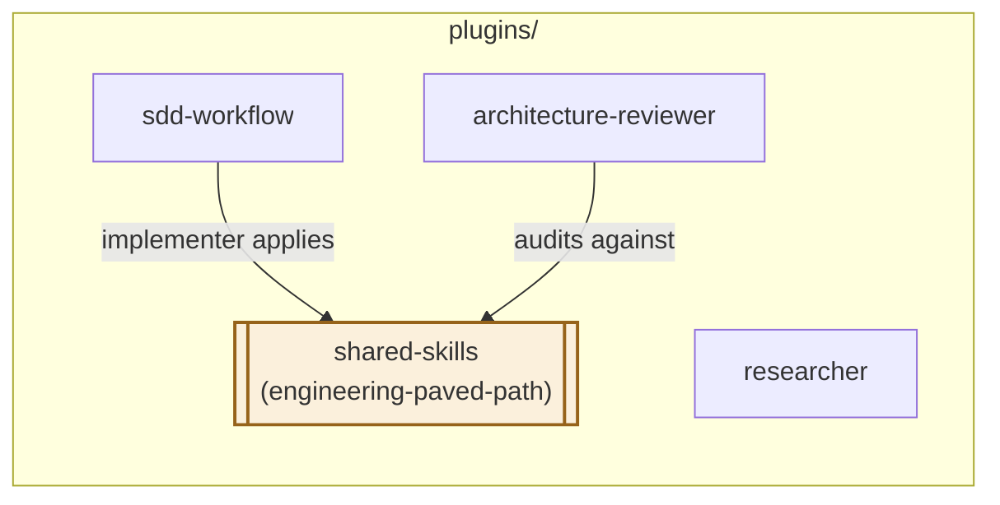

# shared-skills

A dependency-only plugin: skills used by more than one other plugin in
this marketplace, kept in one place instead of vendored into each
consumer. Installing this plugin alone gives you nothing to invoke
directly — it exists to be installed *alongside* the plugins that declare
it as a dependency.

## Skills

- **[engineering-paved-path](skills/engineering-paved-path/SKILL.md)** —
  stack-agnostic structural rules for layered application code (inward-only
  dependencies, thin boundary layers, dependency-injection discipline, a
  secrets chokepoint, an I/O-free core, no duplicated shared contracts).
  Used by [`sdd-workflow`](../sdd-workflow/)'s `implementer` (applied
  proactively while writing code) and by
  [`architecture-reviewer`](../architecture-reviewer/) (audited against
  after the fact) — the same rules, two different jobs against them.

## Why a separate plugin instead of vendoring

A marketplace plugin can't reference files outside its own folder, so
there's no import mechanism between plugin folders — the only way to
share a skill without maintaining duplicate copies is a plugin whose sole
purpose is holding it. This is a documented, not schema-enforced,
dependency: installing a plugin that declares `shared-skills` in its
`dependencies` does not auto-install this one — install it explicitly
alongside.

## Consumers

`researcher` (unconnected above) has no dependency on this plugin — it
never invokes a skill.

## Adding a new shared skill here

Only move a skill into this plugin once it's genuinely used by two or more
other plugins in this marketplace — a skill used by exactly one plugin
belongs in that plugin's own `skills/` folder instead.
